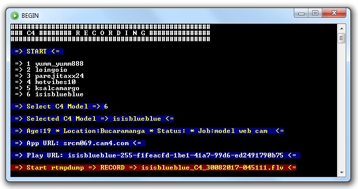
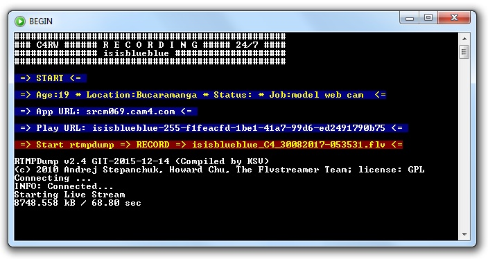

cam4-anonymous
====================
cam4-anonymous lets you follow and archive your selected models' shows on www.cam4.com
So it does not favorites than selected models, which makes it easy to record specific models at a given time, not all the favorites that can be accumulated and too much for our disk free space;)
You don't need to be registered cam4 user for recording models with this cam4-anonymous script.

Requirements
============
[Python 2.7.13](https://www.python.org/ftp/python/2.7.13/python-2.7.13.msi)
[RTMPDump(ksv)](https://github.com/K-S-V/Scripts/releases) used to capture the streams must be somewere in the path or in directory with this script.

Setup
=====
1. Install requirements `pip install -r Requirements.txt`
2. Download and unpack the [code](https://codeload.github.com/horacio9a/cam4-anonymous/zip/master).
3. Open console and go into the directory where you unpacked the files (default is C:/-c4-py/)
4. c4.bat can be anywhere (default is C:/Windows/)
5. Edit `config.cfg` to your wish or accept default data.

Running & Output
================
It's best to use 'Command Promt' first to install `Requirements.txt` and to try the basic `c4.py` script. 
For use these scripts it would be good to make a shortcut and put it in the task bar for easier startup. 
All scripts now use the same text file where is stored your favorite models, default is `C:\-c4-py\C4_Model.txt`. 
However, if you want to record a certain model permanently (24/7), then you need to use `c4.bat`, options number 2 and 3 to start `c4r.py` and `c4rw.py`.
Scripts with the letter 'w' in the name allow you to see what is actually happening in a separate rtmpdump window and make it easier to stop recording. Script `c4w.py` also allow for use the same script copy to start recording more models.
For other scripts if you want to record another model at the same time then you need to start another copy of `c4.bat`. 
All scripts have the ability to display some basic data about the models (Age, Location, Relationship Status and Occupation - Job).
Capture is best abort with Ctrl-C or by clicking 'x' at the top right corner of the script window If Ctrl-C does not react.

c4.py screenshot:

c4rw.py screenshot:

